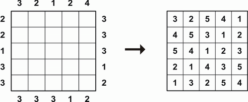

### Задание: Написать программу для решения головоломки «Небоскребы»

##### Описание головоломки:

Есть квадратное поле размера N*N с числами по бокам (числовые ключи). Чтобы решить задачу, нужно расположить во всех
клетках числа от 1 до N (это высота небоскреба)
следующим образом:

1) Каждая строка содержит каждую возможную высоту небоскреба 1 раз
2) Каждый столбец содержит каждую возможную высоту небоскреба 1 раз
3) Каждый числовой ключ описывает количество небоскребов, которые можно увидеть, если вы посмотрите на ячейку с этого
   направления, предполагая, что более короткие небоскребы скрыты за более высокими
4) При отсутствии ключа ограничения на строку или стобец нет

