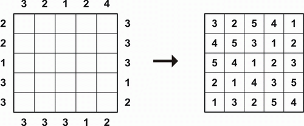
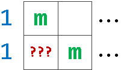
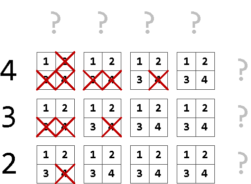
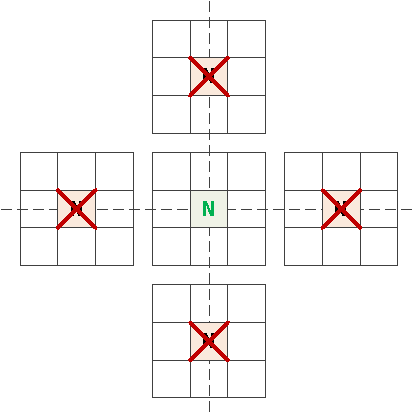
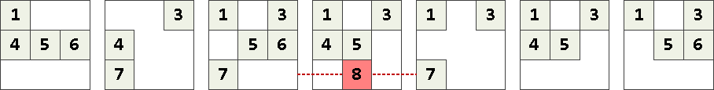
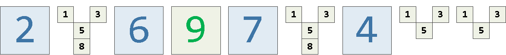
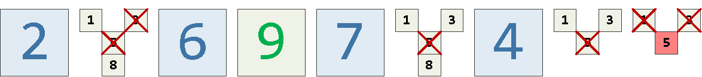

# Теоретическая часть

## Условие задачи

Написать программу для решения головоломки «Небоскребы»

## Подходы к решению задачи

### Формальная постановка задачи

Есть квадратное поле размера N*N с числами по бокам (числовые ключи). Чтобы решить задачу, нужно расположить во всех
клетках числа от 1 до N (это высота небоскреба)
следующим образом:

1) Каждая строка содержит каждую возможную высоту небоскреба 1 раз
2) Каждый столбец содержит каждую возможную высоту небоскреба 1 раз
3) Каждый числовой ключ описывает количество небоскребов, которые можно увидеть, если вы посмотрите на ячейку с этого
   направления, предполагая, что более короткие небоскребы скрыты за более высокими
4) При отсутствии ключа ограничения на строку или столбец нет

### Алгоритм перебора

Алгоритмом полного перебора конечно можно решить 
эту задачу, но за O(n ^ (n * n)) т.к. на каждой из n*n клеток нужно в худшем случае пробовать n вариантов.
Есть более эффективные решения.

### Алгоритм распространения ограничений

Суть этого метода состоит в том, что мы ищем решение
постепенно уменьшая количество вариантов чисел, которые могут
стоять в каждой клетке и когда там останется одно число, оно и будет
решением для клетки. Таким образом, когда в каждой клетке останется только одно число,
головоломка будет решена.
Существует несколько способов распространения ограничений на клетки.

#### 1) Базовые ограничения

##### Установка наибольших чисел

Если на стороне стоит значение видимости 1, то
в соседней ячейке может стоять только максимальное из 
возможных чисел. Т.к. наивысший небоскреб видно всегда.
Сложность этого этапа при применении ко всем клеткам = O(N * 4)

##### Установка ограничений по возможной видимости

Мы не можем поставить высокие небоскребы рядом 
с клеткой видимости, у которой большое значение т.к. в таком
случае высокий небоскреб скроет все, что находится за ним.
Т.е. в игре размера N мы можем поставить небоскреб 
высотой M на позицию K (считая с 1) от ограничения L, если:

L <= N - M + K

В противном случае даже если будут видны все возможные небоскребы до и после
того, что на позиции K, этого будет недостаточно для выполнения
условия видимости. Для каждой клетки просматриваются все видимости (левая, верхняя, правая, нижняя)
и вычеркиваются неподходящие под видимость значения.
Сложность этого этапа при применении ко всем клеткам = O(N ^ 3)

#### 2) Установка ограничений по уникальности чисел

По условию в каждой строке и в каждом столбце
стоят числа от 1 до N, где N - размер игры.
То есть все значения в них различны. Тогда
если в каких-то клетках уже точно стоят некоторые значения, 
то таких значений ну может быть в соответствующих
столбце и строке.
Сложность этого этапа при применении ко всем клеткам = O(N ^ 3)

#### 3) Установка числа при уникальности ограничения

Т.к. в каждой строке и в каждом столбце значения различны,
то при возникновении ситуации, когда лишь в одной ячейке из
целого столбца или строки может, исходя из ограничений,
находиться конкретное число, то оно именно в этой ячейке и должно стоять
Сложность этого этапа при применении ко всем клеткам = O(N ^ 3)

#### 4) Установка ограничений по возможным комбинациям в строке или столбце

Можно распространить ограничения на строку или столбец
путем отсечения вариантов, которые не удовлетворяют
значениям видимости.
Для этого нужно составить все возможные комбинации строки или столбца,
учитывая ограничения и выставленные числа. Т.е. те клетки, где 
стоят числа, являются зафиксированными. 
Затем из полученных вариантов нужно убрать те, что
не проходят по значениям видимости. Из оставшихся
формируются дополнительные ограничения на строку или столбец.

Например, пусть есть строка с ограничениями видимости 3 слева и справа

Тогда возможные варианты строки:

      2 1 6 9 7 8 4 3 5 
      2 1 6 9 7 8 4 5 3 
      2 8 6 9 7 1 4 3 5 
      2 8 6 9 7 1 4 5 3 
      2 8 6 9 7 3 4 1 5 
      2 8 6 9 7 3 4 5 1 
      2 8 6 9 7 5 4 1 3 
      2 8 6 9 7 5 4 3 1 

Из них корректны следующие:

      2 1 6 9 7 8 4 3 5
      2 8 6 9 7 1 4 3 5
      2 8 6 9 7 3 4 1 5

Тогда получаем более точные ограничения

Сложность этого этапа при применении ко всем клеткам = O(N ^ N)

#### 5) Перебор

Если невозможно решить ни одним из способов выше,
то остается только попробовать подставить какое-то значение и
пытаться идти дальше. Предварительно нужно сохранить поле
и позицию, с которой начали перебор, чтобы была возможность
вернуться и поставить другое значение, если окажется, что решений нет.

Сложность этого этапа при применении ко всем клеткам = O(N ^ (N * N))

#### Сам алгоритм:

1) Выставляем базовые ограничения
2) Решаем способом 2. Если не получается, переходим к способу 3. Если
получается, то продолжаем им же (с точки зрения эффективности)
3) Если не удается решить вторым способом, то решаем способом 3.
Если получается, то продолжаем им же.
Когда перестает получаться, возвращаемся к решению способом 2, если им возможно решить. Иначе - к способу 4.
4) Если не получается решить ни способом 2, ни способом 3, то переходим к способу 4.
Если удается решить этим способом, то переходим снова ко второму способу.
Если не удается, то идем к перебору - способу 5
5) Если нельзя решить ни одним из способов, то начинаем перебор.
Запоминаем поле и позицию перебора для него (чтобы при неудаче вернуться)
и подставляем в клетку число, исходя из ограничений и пробуем решить игру,
начиная со способа 2. Если так оказалось, что все значения для 
перебора уже пробовали, то игра не имеет решения.

#### Сложность алгоритма

Если условие такое, что перебор не требуется (в том числе способом 4, по строкам и столбцам), то сложность в худшем =
O(N ^ 3).
Если потребуется перебор по строкам и столбцам, то сложность O(N ^ N).
Если потребуется полный перебор, то сложность O(N ^ (N * N))

## Источники

https://habr.com/ru/company/tensor/blog/552790/

https://en.wikipedia.org/wiki/Constraint_satisfaction
